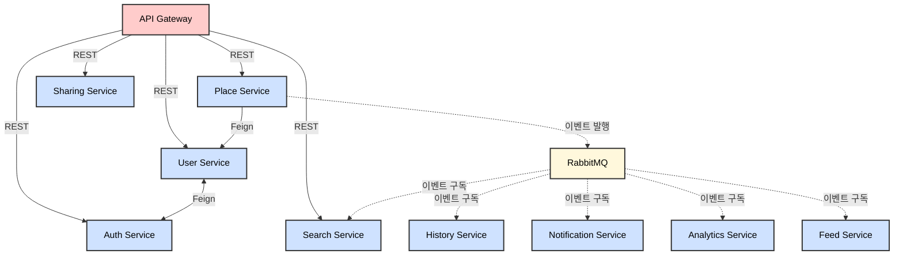
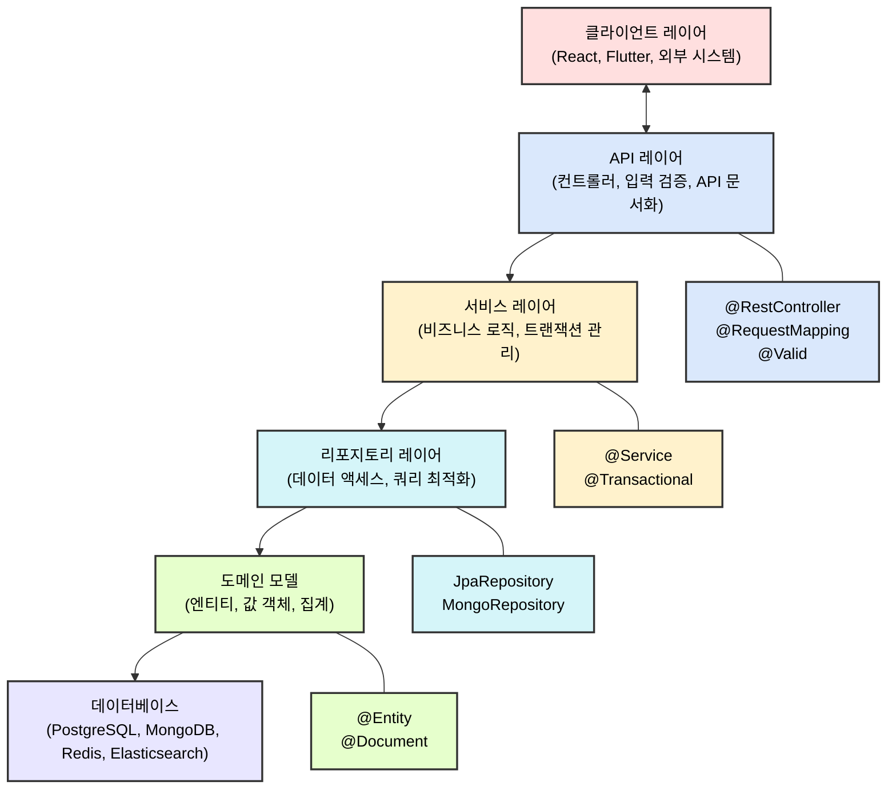
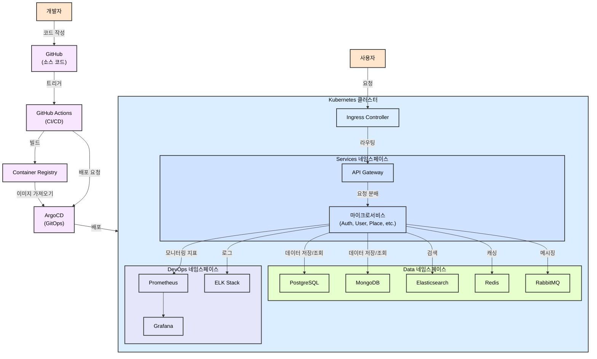
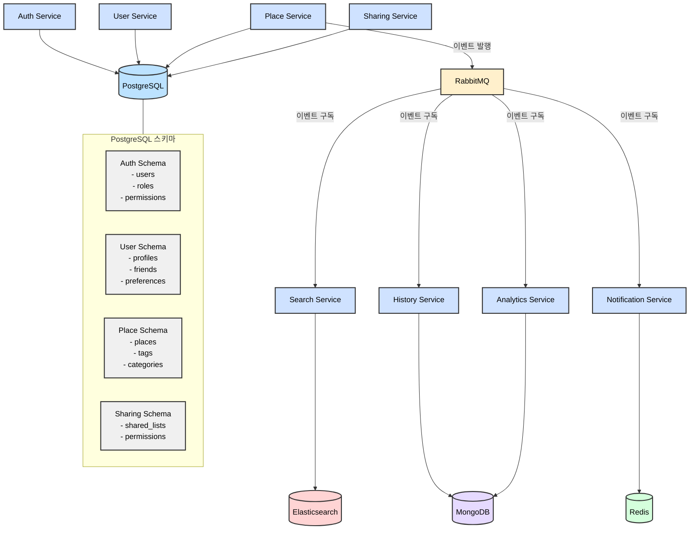
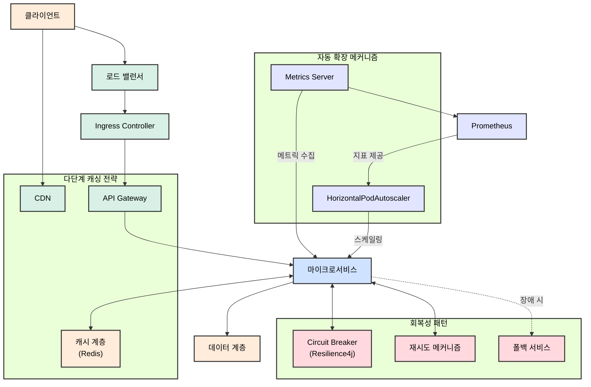
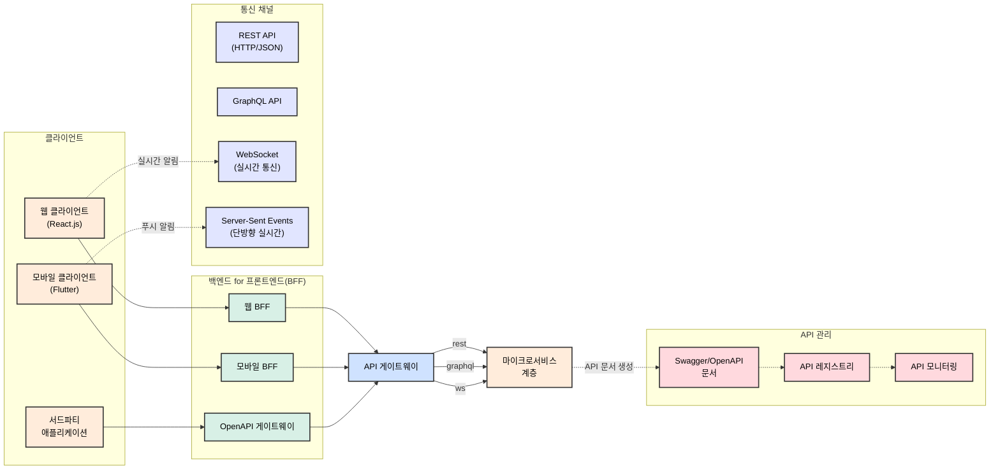

# 랜드마크(Landmark, 나만의 장소를 다른 사람들과 공유하자!)

## 프로젝트 소개

> ℹ️ 여기에 작성된 코드들은 다음과 같은 환경에서 작성되었음을 알려드립니다.  
> - IDE: Curosr
> - AI의 도움을 받아 코드를 작성했습니다.
>   - claude-3.7-sonnet 모델을 사용하였습니다.
>   - Agent와 MCP를 최대한 활용하였습니다.

> ⚠️ 시간이 날 때 조금씩 단계별로 개발해 가며 AI 활용한 개발을 연습하기 위한 프로젝트입니다.

이 프로젝트는 네이버 지도나 카카오 지도, 구글 맵과 같이 나만의 장소를 즐겨찾기 하여 목록으로 관리할 수 있고, 즐겨찾기 목록 뿐만 아니라 각각의 장소에 태그를 달아 다양한 방식으로 관리할 수 있게 해줍니다.
뿐만 아니라 태그별 조회, 즐겨찾기 목록이나 특정 태그로 조회된 목록에서 지역 범위(e.g. 서울시, 강원도 강릉시 등)로 필터링하여 다른 사람들에게 공유할 수 있습니다.

### 주요 기능

- 장소 즐겨찾기 및 관리
- 태그 기반 장소 분류 시스템
- 지역 범위 필터링
- 친구 및 그룹 관리
- 장소 목록 공유 기능
- 사용자 활동 기록 및 분석
- 실시간 알림 시스템

## 기술 스택

- **언어**: Java 17
- **프레임워크**: 
  - Spring Boot 3.2.x
  - Spring Cloud 2023.0.x
- **데이터베이스**: 
  - PostgreSQL (주 데이터베이스)
  - MongoDB (비정형 데이터 저장)
  - Redis (캐싱 및 세션 관리)
  - Elasticsearch (검색 서비스)
- **메시지 브로커**: 
  - RabbitMQ (이벤트 기반 통신)
- **ORM**: Spring Data JPA
- **API 문서화**: SpringDoc (Swagger UI)
- **테스트**: JUnit 5, Mockito, Spring Test, WebTestClient
- **빌드 도구**: Gradle
- **인프라**: 
  - Docker
  - Kubernetes
  - Helm
  - Skaffold
  - Terraform
- **CI/CD**: 
  - Github Action
  - ArgoCD
- **기타 라이브러리**:
  - Lombok: 보일러플레이트 코드 감소
  - Hibernate Validator: 입력 유효성 검증
  - Spring Boot Actuator: 애플리케이션 모니터링
  - Resilience4j: 서킷 브레이커, 재시도 등 회복성 패턴

## 시스템 아키텍처

### 아키텍처 설명

랜드마크 서비스는 확장성, 안정성, 유지보수성을 고려한 마이크로서비스 아키텍처로 설계되었습니다. 아키텍처는 다음과 같은 특징을 가집니다:

1. **클라우드 네이티브**: Kubernetes 환경에서 동작하도록 최적화된 구조
2. **마이크로서비스 분리**: 비즈니스 도메인 기준으로 서비스 분리
3. **API 게이트웨이 패턴**: 모든 요청의 단일 진입점 제공
4. **이벤트 기반 아키텍처**: 서비스 간 느슨한 결합을 위한 메시지 브로커 사용
5. **백엔드 포 프론트엔드(BFF) 패턴**: 클라이언트별 최적화된 API 제공
6. **회복성 패턴**: 서킷 브레이커, 재시도, 타임아웃 등 적용
7. **중앙 집중식 구성 관리**: Spring Cloud Config를 통한 설정 관리
8. **통합 인증/인가**: OAuth2/JWT 기반 보안 체계

아키텍처는 다음과 같은 계층으로 구성됩니다:

- **클라이언트 계층**: React.js 웹 클라이언트와 Flutter 모바일 앱
- **API 게이트웨이 계층**: 요청 라우팅, 인증, 로드 밸런싱
- **마이크로서비스 계층**: 비즈니스 기능별 독립 서비스
- **데이터 계층**: 다양한 데이터 저장소 (SQL, NoSQL, 캐시 등)
- **인프라 계층**: Kubernetes, Docker, CI/CD 파이프라인

### 아키텍처 Overview

```mermaid
graph TB
    %% 외부 액세스
    Client((사용자)) --> Ingress[Ingress Controller]
    %% 쿠버네티스 클러스터
    subgraph Kubernetes["Kubernetes 클러스터"]
        %% 네임스페이스
        subgraph DevOps["DevOps 네임스페이스"]
            GitOps[ArgoCD]
            Prometheus[Prometheus]
            Grafana[Grafana]
            ELK[ELK Stack]
        end
        
        subgraph Data["데이터 네임스페이스"]
            PostgreSQL["PostgreSQL\n(StatefulSet)"]
            MongoDB["MongoDB\n(StatefulSet)"]
            Elasticsearch["Elasticsearch\n(StatefulSet)"]
            Redis["Redis\n(StatefulSet)"]
            RabbitMQ["RabbitMQ\n(StatefulSet)"]
        end
        
        subgraph Services["서비스 네임스페이스"]
            ConfigMap[ConfigMaps]
            Secret[Secrets]
            ConfigServer["Config Server\n(Deployment)"]
            EurekaServer["Service Discovery\n(StatefulSet)"]
            APIGateway["API Gateway\n(Deployment)"]
            Auth["Auth Service\n(Deployment)"]
            User["User Service\n(Deployment)"]
            Place["Place Service\n(Deployment)"]
            Search["Search Service\n(Deployment)"]
            Sharing["Sharing Service\n(Deployment)"]
            History["History Service\n(Deployment)"]
            Notification["Notification Service\n(Deployment)"]
            Analytics["Analytics Service\n(Deployment)"]
            Feed["Feed Service\n(Deployment)"]
        end
        
        %% 서비스 연결
        Ingress --> APIGateway
        APIGateway --> Auth
        APIGateway --> User
        APIGateway --> Place
        APIGateway --> Search
        APIGateway --> Sharing
        APIGateway --> Notification
        APIGateway --> Feed
        
        %% 서비스 디스커버리 연결
        Auth --> EurekaServer
        User --> EurekaServer
        Place --> EurekaServer
        Search --> EurekaServer
        Sharing --> EurekaServer
        History --> EurekaServer
        Notification --> EurekaServer
        Analytics --> EurekaServer
        Feed --> EurekaServer
        
        %% 설정 서버 연결
        Auth --> ConfigServer
        User --> ConfigServer
        Place --> ConfigServer
        Search --> ConfigServer
        Sharing --> ConfigServer
        History --> ConfigServer
        Notification --> ConfigServer
        Analytics --> ConfigServer
        Feed --> ConfigServer
        
        %% 메시지 브로커 연결
        Place -- 이벤트 발행 --> RabbitMQ
        RabbitMQ -- 이벤트 구독 --> Search
        RabbitMQ -- 이벤트 구독 --> History
        RabbitMQ -- 이벤트 구독 --> Notification
        RabbitMQ -- 이벤트 구독 --> Analytics
        RabbitMQ -- 이벤트 구독 --> Feed
        
        %% 데이터베이스 연결
        Auth --> PostgreSQL
        User --> PostgreSQL
        Place --> PostgreSQL
        Sharing --> PostgreSQL
        Search --> Elasticsearch
        History --> MongoDB
        Analytics --> MongoDB
        Notification --> Redis
        
        %% DevOps 도구 연결
        GitOps -- 배포 관리 --> Services
        Prometheus -- 모니터링 --> Services
        Prometheus -- 모니터링 --> Data
        Prometheus --> Grafana
    end
    
    %% 클러스터 외부 서비스
    subgraph External["외부 서비스"]
        GithubActions["GitHub Actions\n(CI/CD)"]
        GCP["Google Cloud\nStorage"]
        SNS["Firebase Cloud\nMessaging"]
    end
    
    GithubActions -- 배포 --> GitOps
    Notification --> SNS
    Place --> GCP
    
    %% 스타일 설정
    classDef services fill:#e0f7fa,stroke:#333,stroke-width:2px,color:#000;
    classDef data fill:#f3e5f5,stroke:#333,stroke-width:2px,color:#000;
    classDef devops fill:#fce4ec,stroke:#333,stroke-width:2px,color:#000;
    classDef external fill:#f5f5f5,stroke:#333,stroke-width:2px,color:#000;
    
    class APIGateway,Auth,User,Place,Search,Sharing,History,Notification,Analytics,Feed,ConfigServer,EurekaServer,ConfigMap,Secret services;
    class PostgreSQL,MongoDB,Elasticsearch,Redis,RabbitMQ data;
    class GitOps,Prometheus,Grafana,ELK devops;
    class GithubActions,GCP,SNS external;
```



### 주요 서비스

- **인프라 서비스**
  - **Config Server** (config-server)
    - 중앙 집중식 구성 관리
    - Git 저장소 기반 구성 관리
    - 환경별 구성 분리 (dev, stage, prod)
  - **Service Discovery** (eureka-server)
    - 서비스 등록 및 발견
    - 로드 밸런싱 지원
    - 서비스 헬스 체크
  - **API 게이트웨이** (api-gateway)
    - 모든 클라이언트 요청의 단일 진입점
    - 서비스 라우팅, 인증 토큰 검증, 요청/응답 변환
    - 속도 제한, CORS 설정
    - 요청 로깅 및 모니터링

- **코어 서비스**
  - **인증 서비스** (auth-service)
    - 사용자 인증 및 권한 부여
    - OAuth2/JWT 토큰 발급 및 검증
    - 소셜 로그인 통합 (구글, 카카오 등)
  - **사용자 서비스** (user-service)
    - 회원 가입, 사용자 정보 관리
    - 프로필 관리
    - 친구 관계 관리, 친구 요청 처리
  - **장소 관리 서비스** (place-service)
    - 장소 즐겨찾기 등록, 수정, 삭제
    - 장소 메타데이터 관리
    - 태그 관리 시스템
    - 위치 기반 서비스 통합
  - **검색 서비스** (search-service)
    - 전문 검색 엔진 (Elasticsearch)
    - 태그, 위치, 키워드 기반 검색
    - 검색 결과 필터링 및 정렬
    - 검색 통계 관리
  - **공유 서비스** (sharing-service)
    - 장소 목록 공유 기능
    - 공유 권한 설정 및 접근 제어
    - 공유 링크 생성 및 관리
  - **히스토리 서비스** (history-service)
    - 사용자 활동 이력 관리
    - 최근 방문 장소, 검색 기록 등 저장
    - 개인 활동 통계

- **지원 서비스**
  - **알림 서비스** (notification-service)
    - 실시간 알림 처리
    - 푸시 알림, 이메일, 인앱 알림
    - 알림 구독 관리
  - **분석 서비스** (analytics-service)
    - 사용자 행동 분석
    - 인기 장소, 트렌드 분석
    - 개인화된 추천 기능
  - **피드 서비스** (feed-service)
    - 소셜 활동 피드 관리
    - 친구 활동 스트림 제공
    - 인기 콘텐츠 큐레이션

- **클라이언트**
  - **웹 클라이언트** (React.js + TypeScript)
    - 반응형 웹 인터페이스
    - 지도 통합 (Kakao/Naver Maps API)
    - 웹 푸시 알림
  - **모바일 앱** (Flutter)
    - 크로스 플랫폼 모바일 앱
    - 네이티브 기능 (위치 서비스, 카메라 등) 통합
    - 푸시 알림 지원

### 세부 아키텍처

#### 인프라 및 배포 아키텍처

랜드마크 서비스는 쿠버네티스를 기반으로 한 클라우드 네이티브 아키텍처로 구성되어 있습니다. 주요 인프라 구성 요소 및 배포 아키텍처는 다음과 같습니다:

1. **쿠버네티스 클러스터 구성**
   - **네임스페이스 분리**: 서비스, 데이터, DevOps 등 기능별 네임스페이스 분리로 자원 관리 및 접근 제어 단순화
   - **리소스 관리**: 서비스별 CPU/메모리 요청 및 제한 설정으로 자원 효율성 확보
   - **수평적 확장성**: HorizontalPodAutoscaler(HPA)를 통한 자동 스케일링 지원
   - **상태 관리**: StatefulSet을 통한 데이터베이스 및 메시징 시스템의 상태 관리

2. **CI/CD 파이프라인**
   - **GitHub Actions**: 코드 변경 시 자동 빌드 및 테스트 실행
   - **GitOps 방식**: ArgoCD를 통한 선언적 인프라 관리 및 자동 배포
   - **환경별 설정 분리**: Kustomize를 활용한 개발, 스테이징, 프로덕션 환경 구성 관리
   - **카나리 배포**: 새 버전의 서비스를 점진적으로 배포하여 위험 최소화

3. **모니터링 및 로깅**
   - **중앙 집중식 모니터링**: Prometheus를 통한 메트릭 수집, Grafana를 통한 시각화
   - **분산 로깅**: ELK 스택(Elasticsearch, Logstash, Kibana)을 통한 로그 관리
   - **알림 시스템**: Alertmanager를 통한 임계치 기반 알림 구성
   - **성능 추적**: 분산 트레이싱을 통한 요청 흐름 및 병목 지점 파악

#### 애플리케이션 아키텍처

랜드마크 서비스의 각 마이크로서비스는 다음과 같은 내부 아키텍처를 따릅니다:

1. **레이어드 아키텍처**
   ```
   ┌─────────────────────────────────┐
   │          API Layer              │ ← REST 컨트롤러, 입력 검증
   ├─────────────────────────────────┤
   │        Service Layer            │ ← 비즈니스 로직, 트랜잭션 관리
   ├─────────────────────────────────┤
   │       Repository Layer          │ ← 데이터 액세스, 쿼리 최적화
   ├─────────────────────────────────┤
   │          Domain Model           │ ← 엔티티, 값 객체, 집계
   └─────────────────────────────────┘
   ```

2. **API 설계**
   - **RESTful API**: 리소스 중심 API 설계, HTTP 메서드 및 상태 코드 적절히 활용
   - **API 버전 관리**: URI 경로 기반 버전 관리 (예: `/api/v1/users`)
   - **DTO 패턴**: 레이어 간 데이터 전송에 DTO(Data Transfer Object) 활용
   - **OpenAPI 문서화**: SpringDoc을 통한 API 문서 자동 생성

3. **보안 아키텍처**
   - **인증**: JWT 기반 토큰 인증 시스템
   - **권한 부여**: 역할 기반 접근 제어(RBAC) 구현
   - **API 보안**: 요청 제한, CORS 설정, 입력 검증 등 다층적 보안 적용
   - **데이터 보안**: 민감 정보 암호화 및 안전한 저장

#### 데이터 아키텍처

랜드마크 서비스의 데이터 관리는 서비스별 특성에 맞는 다양한 데이터베이스를 활용합니다:

1. **다중 데이터베이스 전략**
   - **PostgreSQL**: 트랜잭션 중심 서비스(사용자, 인증, 장소, 공유)
   - **MongoDB**: 비정형 데이터(히스토리, 분석)
   - **Elasticsearch**: 검색 최적화(태그, 키워드, 위치 기반 검색)
   - **Redis**: 캐싱, 세션 관리, 실시간 알림

2. **데이터 정합성 관리**
   - **트랜잭션 경계**: 서비스 내부로 제한된 트랜잭션
   - **SAGA 패턴**: 서비스 간 분산 트랜잭션 처리
   - **최종 일관성**: 이벤트 기반 데이터 동기화
   - **멱등성 보장**: 중복 이벤트 처리에 대한 안전 장치

3. **데이터 마이그레이션 및 백업**
   - **스키마 변경 관리**: Flyway를 통한 데이터베이스 마이그레이션
   - **백업 전략**: 정기적인 백업 및 장애 복구 계획
   - **데이터 보존 정책**: 규정 준수 및 리소스 최적화를 위한 데이터 수명 주기 관리

#### 통신 아키텍처

랜드마크 서비스의 서비스 간 통신은 다음과 같은 패턴을 활용합니다:

1. **동기식 통신**
   - **REST API**: 서비스 간 HTTP 기반 통신
   - **OpenFeign**: 선언적 REST 클라이언트 사용
   - **회로 차단기**: Resilience4j를 통한 장애 격리
   - **재시도 메커니즘**: 일시적 장애에 대한 자동 재시도

2. **비동기식 통신**
   - **이벤트 기반 아키텍처**: RabbitMQ를 통한 메시지 중심 통신
   - **발행-구독 패턴**: 이벤트 발행자와 구독자 간의 느슨한 결합
   - **메시지 보장**: 지속성, 확인 응답 및 재전송을 통한 메시지 전달 보장
   - **이벤트 스키마 관리**: 호환성을 위한 이벤트 계약 관리

3. **서비스 메시 패턴**
   ```
   ┌───────────────┐    ┌───────────────┐    ┌───────────────┐
   │  API Gateway  │───→│ Auth Service  │←───│ User Service  │
   └───────┬───────┘    └───────────────┘    └───────────────┘
           │                    ↑                    ↑
           │                    │                    │
           ↓                    │                    │
   ┌───────────────┐    ┌───────────────┐    ┌───────────────┐
   │ Place Service │───→│ Search Service│←───│History Service│
   └───────┬───────┘    └───────────────┘    └───────────────┘
           │                    ↑                    ↑
           │                    │                    │
           ↓                    │                    │
   ┌───────────────┐    ┌───────────────┐    ┌───────────────┐
   │Sharing Service│───→│   RabbitMQ    │←───│  Feed Service │
   └───────────────┘    └───────────────┘    └───────────────┘
   ```

#### 통신 아키텍처 다이어그램



#### 애플리케이션 레이어 아키텍처 다이어그램



#### 인프라 아키텍처 다이어그램



#### 데이터 아키텍처 다이어그램



#### 확장성 및 성능 아키텍처

랜드마크 서비스의 확장성 및 성능은 다음과 같은 방식으로 설계되었습니다:

1. **수평적 확장성**
   - **스테이트리스 서비스**: 상태를 저장하지 않는 서비스 설계로 수평 확장 용이
   - **자동 스케일링**: 부하에 따른 포드 수 자동 조정
   - **로드 밸런싱**: 서비스 디스커버리와 쿠버네티스 서비스를 통한 부하 분산

2. **성능 최적화**
   - **캐싱 전략**: 다단계 캐싱(클라이언트, API 게이트웨이, 서비스 레벨)
   - **비동기 처리**: 장기 실행 작업의 비동기 처리
   - **데이터베이스 최적화**: 인덱싱, 쿼리 최적화, 연결 풀링
   - **콘텐츠 전송 최적화**: CDN 활용 및 정적 자산 최적화

3. **회복성 패턴**
   - **장애 격리**: 서킷 브레이커를 통한 장애 확산 방지
   - **백오프 전략**: 지수 백오프를 통한 재시도 간격 조절
   - **폴백 메커니즘**: 서비스 불가 시 대체 응답 제공
   - **자동 복구**: 자가 치유 메커니즘을 통한 시스템 안정성 확보

#### 확장성 및 성능 아키텍처 다이어그램



#### 클라이언트-서버 통신 아키텍처

1. **BFF(Backend For Frontend) 패턴**
   - 웹 클라이언트와 모바일 앱을 위한 최적화된 API 제공
   - 클라이언트별 요구사항에 맞춘 데이터 페칭 및 처리
   - API 응답 포맷 및 크기 최적화

2. **실시간 통신**
   - WebSocket 기반 양방향 통신
   - 실시간 알림, 피드 업데이트, 사용자 상태 정보 전달
   - 연결 유지 및 재연결 메커니즘 구현

3. **API 계약 관리**
   - 클라이언트-서버 간 인터페이스 정의
   - API 버전 관리 및 하위 호환성 유지
   - OpenAPI(Swagger) 규격 준수

#### 클라이언트-서버 통신 아키텍처 다이어그램



### 디렉토리 구조

```
landmark/
├── .github/                        # GitHub 워크플로우 및 CI/CD 구성
├── k8s/                            # Kubernetes 매니페스트 파일
│   ├── base/                       # 기본 구성 요소
│   └── overlays/                   # 환경별 오버레이 (dev, stage, prod)
├── services/                       # 백엔드 마이크로서비스
│   ├── api-gateway/                # API Gateway 서비스
│   ├── auth-service/               # 인증 서비스
│   ├── user-service/               # 사용자 서비스
│   ├── place-service/              # 장소 관리 서비스
│   ├── search-service/             # 검색 서비스
│   ├── sharing-service/            # 공유 서비스
│   ├── history-service/            # 히스토리 서비스
│   ├── notification-service/       # 알림 서비스
│   ├── analytics-service/          # 분석 서비스
│   ├── feed-service/               # 피드 서비스
│   ├── config-server/              # 구성 서버
│   └── eureka-server/              # 서비스 디스커버리 서버
├── frontend/                       # 프론트엔드 애플리케이션
│   ├── app-client/                 # Flutter 앱 클라이언트
│   └── web-client/                 # React 웹 클라이언트
├── shared/                         # 공유 라이브러리 및 모듈
│   ├── common-dto/                 # 공통 DTO 클래스
│   ├── common-utils/               # 공통 유틸리티 함수
│   └── common-security/            # 공통 보안 구성
├── docker/                         # Docker 관련 설정
│   └── config/                     # 컨테이너 구성 파일
├── terraform/                      # 인프라 코드
│   ├── modules/                    # Terraform 모듈
│   └── environments/               # 환경별 구성
├── docs/                           # 프로젝트 문서
├── settings.gradle                 # Gradle 설정
├── build.gradle                    # 루트 빌드 파일
└── README.md                       # 프로젝트 소개
```

### 서비스 내부 구조 예시 (place-service)

```
services/place-service/
├── src/
│   ├── main/
│   │   ├── java/com/landmark/placeservice/
│   │   │   ├── config/              # 설정 클래스
│   │   │   │   ├── SecurityConfig.java
│   │   │   │   ├── KafkaConfig.java
│   │   │   │   └── SwaggerConfig.java
│   │   │   ├── controller/          # API 컨트롤러
│   │   │   │   ├── PlaceController.java
│   │   │   │   └── TagController.java
│   │   │   ├── service/             # 비즈니스 로직
│   │   │   │   ├── PlaceService.java
│   │   │   │   ├── PlaceServiceImpl.java
│   │   │   │   ├── TagService.java
│   │   │   │   └── TagServiceImpl.java
│   │   │   ├── repository/          # 데이터 액세스 계층
│   │   │   │   ├── PlaceRepository.java
│   │   │   │   └── TagRepository.java
│   │   │   ├── entity/              # 데이터 저장 객체
│   │   │   │   ├── Place.java
│   │   │   │   ├── Tag.java
│   │   │   │   └── PlaceTag.java
│   │   │   ├── dto/                 # 데이터 전송 객체
│   │   │   │   ├── PlaceDTO.java
│   │   │   │   ├── TagDTO.java
│   │   │   │   └── request/         # 요청 객체
│   │   │   │       ├── PlaceRequest.java
│   │   │   │       └── TagRequest.java
│   │   │   ├── event/               # 이벤트 관련 클래스
│   │   │   │   ├── PlaceCreatedEvent.java
│   │   │   │   └── EventPublisher.java
│   │   │   ├── exception/           # 예외 처리
│   │   │   │   ├── ResourceNotFoundException.java
│   │   │   │   └── GlobalExceptionHandler.java
│   │   │   ├── client/              # 외부 서비스 클라이언트
│   │   │   │   └── UserServiceClient.java
│   │   │   ├── util/                # 유틸리티 클래스
│   │   │   │   └── GeoUtils.java
│   │   │   └── PlaceServiceApplication.java  # 애플리케이션 진입점
│   │   └── resources/
│   │       ├── application.yml      # 애플리케이션 설정
│   │       └── bootstrap.yml        # Spring Cloud Config 설정
│   └── test/                        # 테스트 코드
│       └── java/com/landmark/placeservice/
│           ├── controller/
│           │   └── PlaceControllerTest.java
│           ├── service/
│           │   └── PlaceServiceTest.java
│           └── repository/
│               └── PlaceRepositoryTest.java
├── Dockerfile                       # Docker 빌드 설정
├── build.gradle                     # Gradle 빌드 파일
└── README.md                        # 서비스 문서
```

### 워크플로우

1. **개발 워크플로우**
   - 개발자가 기능 브랜치에서 코드 작성
   - Pull Request 생성 및 코드 리뷰
   - 자동화된 테스트 및 빌드 (GitHub Actions)
   - 스테이징 환경에 자동 배포
   - QA 및 테스트
   - 메인 브랜치 병합 및 프로덕션 배포

2. **사용자 요청 워크플로우**
   - 클라이언트에서 API 게이트웨이로 요청
   - API 게이트웨이에서 인증 토큰 검증
   - 요청을 적절한 마이크로서비스로 라우팅
   - 서비스가 비즈니스 로직 처리 (필요 시 다른 서비스와 통신)
   - 결과를 클라이언트에 반환

3. **이벤트 기반 워크플로우 예시** (새 장소 추가)
   - 사용자가 새 장소 추가 요청
   - `place-service`가 장소 정보 저장
   - `place-service`가 장소 생성 이벤트 발행
   - `search-service`가 이벤트 구독하여 검색 인덱스 업데이트
   - `history-service`가 이벤트 구독하여 사용자 활동 기록
   - `notification-service`가 이벤트 구독하여 관련 알림 발송

## 데이터베이스 설계

### 테이블 정의서

### 인덱스 정의

### ER 다이어그램

### 엔티티 설명

## 실행 방법

## 테스트 코드 실행 방법

## API 엔드포인트

